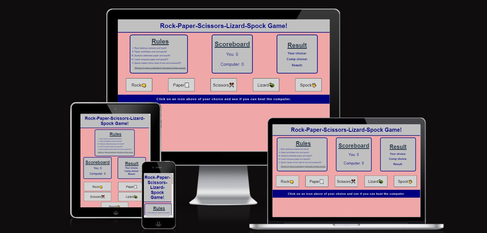
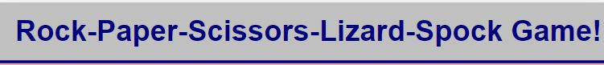
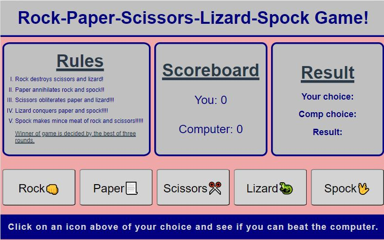
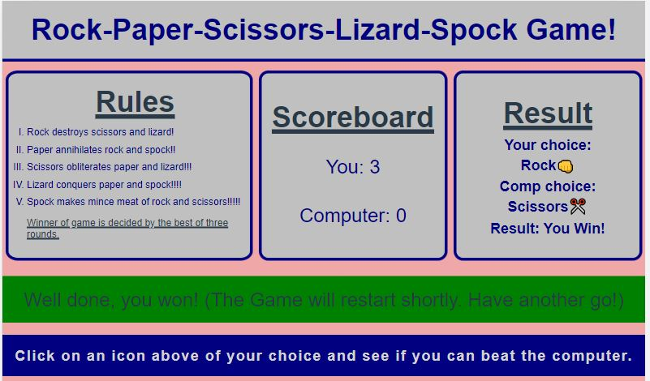
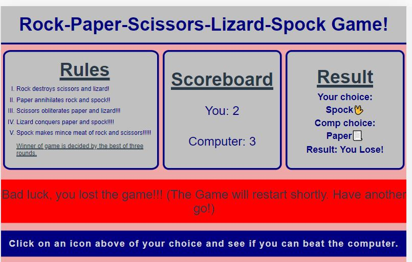
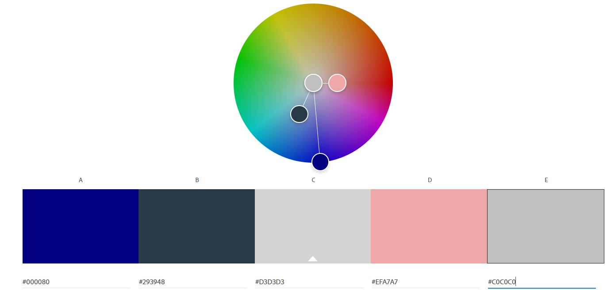

# RPSLS Game!
(Developer: James Lynch)

[Live webpage](https://jamsey911.github.io/RPSLS_MP2/index.html)

## Table of Content

1. [Introduction](#introduction)
2. [Design Goals](#design-goals)
3. [Design Features](#design-features)
4. [User Story](#user-utory)
5. [Wireframes](#wireframes)
6. [Testing](#validation)
8. [Bugs](#Bugs)
9. [Deployment](#deployment)
10. [Credits](#credits)
11. [Tools used and Coding Inspiration](#tools-used-and-coding-inspiration)

### INTRODUCTION.

This project was developed to showcase an evolved game of Rock Paper Scissors to incorporate two extra variables with the options of Lizard or Spock. This was made popular through the TV series, 'The Big Bang Theory'. This game creates a 1 v 1 againest the computer in a game of chance. To view the full website please use the clickable link via the heading at the top of this page or alternatively, click on the following link to access the site: [Rock Paper Scissors Lizard Spock](https://jamsey911.github.io/RPSLS_MP2/index.html)

<!-- 
<a href="#home">Return to table of contents</a>

 -->

### DESIGN GOALS.

The project idea has been created for the purpose to build an interactive front-end site that should respond to the users' when they interact with the data presented. This site should allow users to actively engage and change the way the information is displayed to achieve an end goal.

### DESIGN FEATURES.

- ## Header.

This is a simple header displaying the title of the game. 

- ## Footer.

The footer has been designed to indicate to the user of where the icon's are that can be selected.

- ## Page Design.
  The page design has been specifically created to portray a clean, fun and engaging experience for the user. The page content is presented in a clear and accessible fashion for the user to understand.

-  ### Main Page.

The main game area is displayed below the header. It has 4 elements, the Rules, Scoreboard, Results and the Selections. The Rules is displayed in the top left with an easy to read listed format. The Scoreboard is displayed centraly to give the user clear indication of the users score compared to the computers score. The Result section is displayed in the top right to give the user the display of the selections selected. And the Selections are displayed below in which these are the icons displayed for the user to select in order to interact with the game. 

The Selections screen has two alternatives when a game is completed in which the selections are removed for a breif moment and replaced with a display based on the result of the game.A green display is created when the user wins and a red display when the user has lost.

- ## WIN SCREEN

 - ## LOSE SCREEN

- ## COLOUR PALETTE.
  The colour palette is purposefully simple and clean. It consists of the following six colour choices:

<!-- These colours provide a high level of contrast for users with impaired vison, as confirmed in the testing section below. They also add to the overall goal of creating a clear, engaging and fun design ethos. The colors were chosen in conjunction with the background image to present a smooth, related connection across the application. This helps provide consistency to the overall aesthetic flow of the user experience.

- ## Font.
  The font used for the page is Amatic SC. It is a simple but effective hand drawn webfont. It was initially designed by Vernon Adams, and concieved of to be used freely across the internet. It features both Latin and Hebrew alphabets. The Latin was initially designed by Vernon Adams. The Hebrew was designed by Ben Nathan, who also revised the Latin design. Thomas Jockin respaced and kerned the whole font. -->