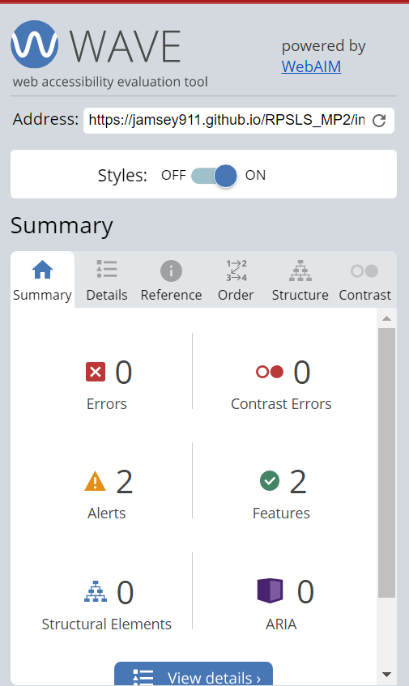

# RPSLS Game!
(Developer: James Lynch)

[Live webpage](https://jamsey911.github.io/RPSLS_MP2/index.html)

## Table of Content

1. [Introduction](#introduction)
2. [Design Goals](#design-goals)
3. [Design Features](#design-features)
4. [User Story](#user-story)
5. [Wireframes](#wireframes)
6. [Testing](#testing)
8. [Bugs](#bugs)
9. [Deployment](#deployment)
10. [Credits](#credits)
11. [Tools used and Coding Inspiration](#tools-used-and-coding-inspiration)

## INTRODUCTION

This project was developed to showcase an evolved game of Rock Paper Scissors to incorporate two extra variables with the options of Lizard or Spock. This was made popular through the TV series, 'The Big Bang Theory'. This game creates a 1 v 1 againest the computer in a game of chance. To view the full website please use the clickable link via the heading at the top of this page or alternatively, click on the following link to access the site: [Rock Paper Scissors Lizard Spock](https://jamsey911.github.io/RPSLS_MP2/index.html)

<!-- 
<a href="#home">Return to table of contents</a>

 -->

## DESIGN GOALS

The project idea has been created for the purpose to build an interactive front-end site that should respond to the users' when they interact with the data presented. This site should allow users to actively engage and change the way the information is displayed to achieve an end goal.

## DESIGN FEATURES

### HEADER

This is a simple header displaying the title of the game. 

### FOOTER

The footer has been designed to indicate to the user of where the icon's are that can be selected.

### PAGE DESIGN
  The page design has been specifically created to portray a clean, fun and engaging experience for the user. The page content is presented in a clear and accessible fashion for the user to understand.

### MAIN GAME AREA

The main game area is displayed below the header. It has 4 elements, the Rules, Scoreboard, Results and the Selections. The Rules is displayed in the top left with an easy to read listed format. The Scoreboard is displayed centraly to give the user clear indication of the users score compared to the computers score. The Result section is displayed on the top right to give the user the display of the selections selected. And the Selections are displayed below in which these are the buttons for the user to select in order to interact with the game. 

The Selections screen has two alternatives when a game is completed in which the selections are removed for a breif moment and replaced with a display based on the result of the game.A green display is created when the user wins and a red display when the user has lost.

### RULES SECTION

### SCOREBOARD SECTION

### RESULTS SECTION

### SELECTIONS SECTION

### WIN SCREEN

### LOSE SCREEN

### COLOUR PALETTE
  The colour palette is purposefully simple and clean. It consists of the following six colour choices:

The colour sheme was chosen as a navy and grey/silver theme with a light pink backround in the body. This was also aided by adobe color in which a Complementary Color was selected. I feel the colour's contrast well to give the site a consistency aesthetic flow for a pleasing user experience.

### FONT
Bakbak One is the font usedn for the site. I feel it has an appealing look thats complements all elements of the page. I think this font stands out well while not being too aggressive.
San-serif was used as my backup.

## USER STORY

#### First-time User
1. As a first time user, I want to find the site easy to use
2. As a first time user, I want the site to be visuallly appealing
3. As a first time user, I want all information to be present
4. As a first time user, I want all rules to the game to be clearly indicated
5. As a first time user, I want a game that is interactive
6. As a first time user, I want no confusion in regards to the exact landing page

#### Returning User
1. As a returning user, I want a game that is replayable
2. As a returnign user, I want to play a simple game of chance
3. As a returning user, I want an easy to understand game interface

#### Site Owner
1. As the site owner, I want users to find the site easy to use
2. As the site owner, I want the site to be visuallly appealing
3. As the site owner, I want all information to be present

## WIREFRAMES

For the site pages the wireframe preliminary layout designs can be seen below. These were created using [Balsamiq](https://balsamiq.com/):

- Main Page

- 404 Page

## TESTING

### HTML VALIDATION
The W3C Markup Validation Service was used to validate the HTML of the website. All pages pass with no errors or warnings.

Index

404

### CSS VALIDATION
The W3C Jigsaw CSS Validation Service was used to validate the CSS of the website.
All pages pass with no errors or warnings.

Index

404

### ACCESSIBILITY
The WAVE WebAIM web accessibility evaluation tool was used to ensure the website met high accessibility standards. All pages pass with 0 errors.

Index

404

### PERFORMANCE 
Google Lighthouse in Google Chrome Developer Tools was used to test the performance of the website. 

Index

### JAVASCRIPT VALIDATION
[JS Hint](https://jshint.com/) was used to detect errors and potential problems in the JavaScript code.

Javascript Testing

#### Performing tests on various devices 
The website was tested on the following devices:
- HP Pavilion laptop
- Samsung S21+
- Ipad (8th Generation)

In addition, the website was tested using Google Chrome Developer Tools Device Toggeling option for all available device options.

### BROWSER COMPATABILITY 
The website was tested on the following browsers:
- Google Chrome
- Microsoft Egde
- Apple Safari

### TESTING USER STORIES

1. As a first time user, I want to find the site easy to use

| **Feature** | **Action** | **Expected Result** | **Actual Result** |
|-------------|------------|---------------------|-------------------|
| Footer section | Navigate to the footer | Details showing how to play the game | Works as expected |
| Rules Section | Navigate to the home page  | Rules can be seen on the left  | Works as expected |

Screenshots

2. As a first time user, I want the site to be visuallly appealing

| **Feature** | **Action** | **Expected Result** | **Actual Result** |
|-------------|------------|---------------------|-------------------|
| Results Section | Navigate to the home page | Results show current result | Works as expected |
| Selections section | Navigate to the home page | See selections transform or be replaced when the user wins'/loses' | Works as expected |

Screenshots

3. As a first time user, I want all information to be present

| **Feature** | **Action** | **Expected Result** | **Actual Result** |
|-------------|------------|---------------------|-------------------|
| Home page | Navigate to the Home Page | Displayed on home page is all information needed | Works as expected |

Screenshots

4. As a first time user, I want all rules to the game to be clearly indicated

| **Feature** | **Action** | **Expected Result** | **Actual Result** |
|-------------|------------|---------------------|-------------------|
| Rules Section | Navigate to the home page  | Rules can be seen on the left  | Works as expected |

Screenshots

5. As a first time user, I want a game that is interactive

| **Feature** | **Action** | **Expected Result** | **Actual Result** |
|-------------|------------|---------------------|-------------------|
| Results Section | complete a game | Results appear when selectios are chosen | Works as expected |
| Selections section | Win three games | See selections transform or be replaced when the user wins'/loses' | Works as expected |
| Audio | Win three games | A audio file is played when user wins'/loses' three game | Works as expected |

Screenshots

6. As a first time user, I want no confusion in regards to the exact landing page

| **Feature** | **Action** | **Expected Result** | **Actual Result** |
|-------------|------------|---------------------|-------------------|
| 404 Error Page | Enter incorrect landing page | 404 image is shown  | Works as expected |

Screenshots

7. As a returning user, I want a game that is replayable

| **Feature** | **Action** | **Expected Result** | **Actual Result** |
|-------------|------------|---------------------|-------------------|
| Scoreboard | Win three games | Game automatically resets after a brief moment | Works as expected |

Screenshots

8. As a returnign user, I want to play a simple game of chance

| **Feature** | **Action** | **Expected Result** | **Actual Result** |
|-------------|------------|---------------------|-------------------|
| Game of chance | Interact with Seletions | Review result in Results section | Works as expected |

Screenshots

9. As a returning user, I want an easy to understand game interface

| **Feature** | **Action** | **Expected Result** | **Actual Result** |
|-------------|------------|---------------------|-------------------|
| Body section | Interact with game | All details visable | Works as expected |

Screenshots

10. As the site owner, I want users to find the site easy to use

| **Feature** | **Action** | **Expected Result** | **Actual Result** |
|-------------|------------|---------------------|-------------------|
| Results Section | Navigate to the home page | All site details are clearly visible | Works as expected |
| Selections section | Navigate to the home page | See selections transform or be replaced when the user wins'/loses' | Works as expected |

Screenshots

11. As the site owner, I want the site to be visuallly appealing

| **Feature** | **Action** | **Expected Result** | **Actual Result** |
|-------------|------------|---------------------|-------------------|
| Home Page | Access website | Website laied out in an easy to read fashion | Works as expectd |

Screenshots

12. As the site owner, I want all information to be present

| **Feature** | **Action** | **Expected Result** | **Actual Result** |
|-------------|------------|---------------------|-------------------|
| Home page | Navigate to the home page  | All information is visible  | Works as expected |

Screenshots

## BUGS

| **Bug** | **Fix** |
| ----------- | ----------- |
| Results function not displaying correct result | Changed getResult function in Javascript |
| Scoreboard not incrementing | Corrected  incrementScore function in Javascript |
| Screen width not displaying correcty with media queries | Edited header element in CSS|
| bestOfThree funtion not displaying Win/Lose page | Declared the user and computers score in javascript |
| Selections incorrectly displayed | Made Media query change to the size of selection |

## Deployment
This website was created and deployed through GitHub Pages by following these steps:
1. Oepn Github repository and select the settings tab
2. Select pages on the left hand side
3. Select source and the option for Branch: master
4. The webpage refreshes automaticaly (You may need to refresh again yourself) you should see a prompt saying: "Your site is published at https://jamsey911.github.io/RPSLS_MP2/index.html"

You can for fork the repository by following these steps:
1. From the GitHub repository
2. Click the Fork button on the upper right hand corner

You can clone the repository by following these steps:
1. From the GitHub repository 
2. Select the Code button on top of the list of files
3. Choose your prefeared option to clone HTTPS, SSH, or Github CLI. Select the copy button to copy the URL to your clipboard
4. Open Git Bash and edit the current working directory to the one where you want the copied directory
5. Type git clone and paste in URL that you copied ($ git clone https://github.com/YOUR-USERNAME/YOUR-REPOSITORY)
6. Next click enter and you will have your local clone

## Credits

### Media
In order of apearance:
Win Audion: Eponn Src:https://pixabay.com/sound-effects/correct-6033/
- [lose.mp3](assets/audio/lose.mp3): Audio by <a href="https://pixabay.com/sound-effects/negative-beeps-6008/">themusicalnomad</a> on <a href="https://pixabay.com/">Pixabay</a>
- [win.mp3](assets/images/win.mp3): Audio by <a href="https://pixabay.com/sound-effects/correct-6033/">Eponn </a> on <a href="https://pixabay.com/">Pixabay</a>
- [404 error image](assets/images/404img.jpg): Image by <a href="https://www.freepik.com/author/pikisuperstar">pikisuperstar</a> on <a href="https://www.freepik.com/free-vector/error-404-concept-landing-page_5060705.htm#query=404&position=8&from_view=search&track=sph%22%3EImage%20by%20pikisuperstar%3C/a%3E%20on%20Freepik">Freepix</a> 

  
### Code
In order of apearance:
- The initial Javascript derived from the teachings of [Ania Kubow](https://www.youtube.com/@AniaKubow) in her video [3 ways to code Rock Paper Scissors in JavaScript](https://www.youtube.com/watch?v=RwFeg0cEZvQ)
- My README.md was based off the template illastrated by [Keith Millar's](https://github.com/GrumpyRobot21) in his project [Rock Paper Scissor Lizrd Spock](https://github.com/GrumpyRobot21/Rock-Paper-Scissors-Lizard-Spock---Portfolio-Project-2---JavaScript-Essentials/blob/main/assets/js/script.js)

## Acknowledgements
I would like to give a big thank you to:
- My mentor Mo Shami for his feedback and helpful advice
- My family and friends
- To Code Institute for their helpful and informative guidance

